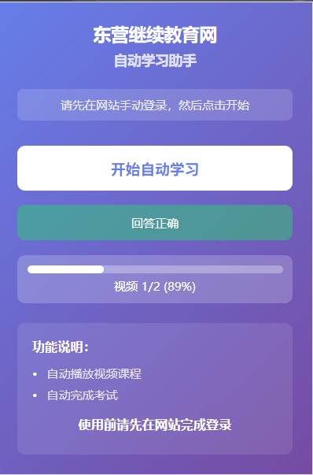

# 东营继续教育网自动学习助手

东营市专业技术人员公需科目培训平台（sddy.gxk.yxlearning.com）的 Chrome 浏览器扩展，用于自动化完成视频播放和在线考试。



## 功能

- **自动播放视频** — 自动检测未完成的课程和视频，逐个播放至完成
- **自动答题** — 视频播放中出现弹题时自动尝试作答，直到正确
- **自动静音** — 播放视频时自动静音
- **自动完成考试** — 遍历待参加考试并自动提交

## 使用方式

1. 在 Chrome 浏览器中加载已解压的扩展程序
2. 手动登录 [东营继续教育网](http://sddy.gxk.yxlearning.com/index)
3. 点击扩展图标，点击 **开始自动学习**
4. 扩展将自动进入学习中心 → 播放未完成视频 → 完成待参加考试

## 安装

1. 打开 Chrome 浏览器，进入 `chrome://extensions/`
2. 开启右上角 **开发者模式**
3. 点击 **加载已解压的扩展程序**，选择本项目目录
4. 扩展图标将出现在工具栏中

## 工作原理

扩展注入 Content Script 到目标站点，通过状态机驱动自动化流程：

```
学习中心 → 进入未完成课程 → 播放所有视频（弹题自动答） → 
返回学习中心 → 继续下一课程 → 全部完成后进入在线考试 → 
提交所有待考试卷 → 完成
```

状态持久化存储在 `chrome.storage.local` 中，即使页面刷新或导航也能自动恢复进度。

## 技术栈

- Manifest V3
- Chrome Extension API (storage, tabs, cookies, scripting)
- 原生 JavaScript (无第三方依赖)
