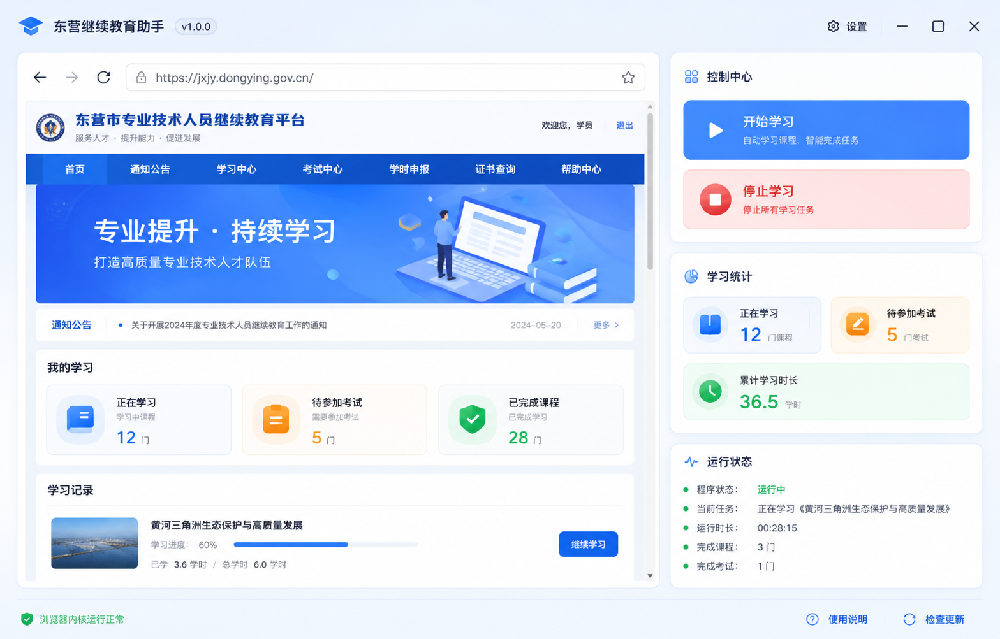

# 东营继续教育助手

面向“东营市专业技术人员继续教育平台”的自动化学习辅助项目。项目包含两个形态：

- Chrome 扩展版：通过浏览器扩展在目标站点中注入自动化脚本。
- Electron 独立版：内置浏览器窗口和右侧控制面板，适合直接双击运行。



## 功能概览

- 自动查找未完成课程并进入学习页面。
- 自动播放视频课程，并尽量保持静音播放。
- 处理课程播放过程中的弹题。
- 统计运行状态、课程进度、考试数量和运行时长。
- 支持考试模式，对已抓取到答案的数据进行自动匹配。
- 独立版提供内置浏览器、开始学习、停止学习、开始考试等操作入口。

## Chrome 扩展版

安装方式：

1. 打开 Chrome，进入 `chrome://extensions/`。
2. 开启右上角“开发者模式”。
3. 点击“加载已解压的扩展程序”。
4. 选择项目根目录 `E:\jixujiaoyu`。
5. 登录目标学习平台后，点击扩展图标启动。

主要文件：

- `manifest.json`：扩展配置。
- `content.js`：页面自动化逻辑。
- `background.js`：后台通信和状态处理。
- `popup.html`、`popup.css`、`popup.js`：扩展弹窗界面。

## Electron 独立版

独立版代码在 `standalone/` 目录。首次运行：

```powershell
cd E:\jixujiaoyu\standalone
npm install
npm start
```

打包 Windows 解包目录：

```powershell
npm run build:exe
```

打包产物默认输出到：

```text
standalone/dist-electron/win-unpacked/
```

这些构建产物体积很大，已通过 `.gitignore` 排除，不会提交到 GitHub。

## 仓库内容说明

仓库保留源码、界面资源、脚本和必要配置；不提交以下本地生成内容：

- `standalone/node_modules/`
- `standalone/dist/`
- `standalone/dist-electron/`
- `standalone/.profile*/`
- `standalone/traces/`
- `standalone/exam-captures/`

## 注意事项

本项目用于个人学习自动化研究和本地辅助操作。使用前请确认符合目标平台规则，避免影响平台正常服务或违反相关使用条款。
