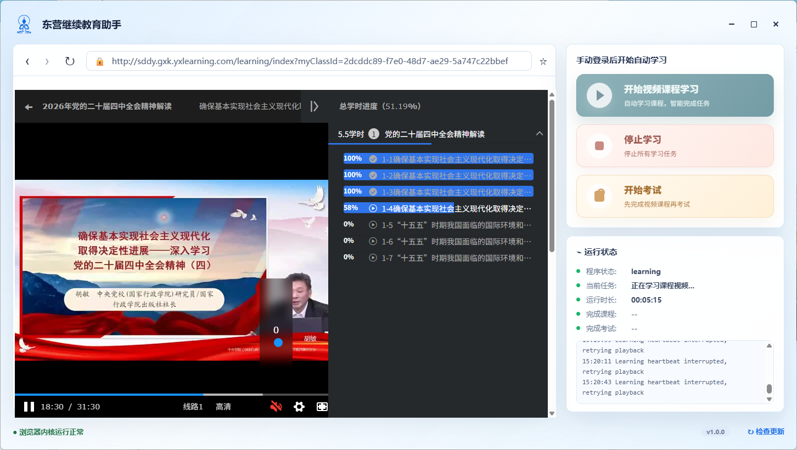

# 东营继续教育助手独立版



这是项目的 Electron 独立运行版本。不依赖 Chrome 扩展，启动后会打开一个桌面窗口：左侧是内置浏览器，右侧是学习控制面板。

## 功能

- 内置浏览器打开继续教育平台
- 手动登录后开始自动学习、停止学习和考试流程
- 实时显示程序状态、当前任务、运行时长、课程与考试统计
- 通过 Playwright CDP 控制内置 BrowserView，实现页面、视频和考试流程自动化
- 内置静音、页面弹窗隐藏、学习异常恢复等辅助能力

## 安装

```powershell
cd E:\jixujiaoyu\standalone
npm install
```

## 运行

```powershell
npm start
```

常用运行模式：

```powershell
npm run start:auto
npm run start:exam
npm run start:exam:submit
```

环境变量：

- `BASE_URL`：目标平台地址，默认 `http://sddy.gxk.yxlearning.com`
- `PROXY_SERVER`：可选代理，例如 `http://127.0.0.1:10808`
- `AUTO_CONTINUE`：设为 `1` 时启动后自动开始
- `EXAMS_ONLY`：设为 `1` 时只执行考试模式
- `ALLOW_EXAM_SUBMIT`：控制是否允许自动提交考试

## 打包

```powershell
npm run build:exe
```

打包输出：

```text
dist-electron/win-unpacked/
```

## 主要文件

- `src/electron-main.cjs`：Electron 主进程、窗口、BrowserView 和 IPC
- `src/electron-shell.html`：桌面界面
- `src/electron-preload.cjs`：渲染层与主进程通信桥
- `src/electron-automation.cjs`：学习与考试自动化逻辑

## 更新方式

当前版本使用手动更新，不在后台自动替换程序文件。

界面右下角“检查更新”按钮会打开 GitHub Releases 页面：

```text
https://github.com/hexianyun/dongyingjixujiaoyu-automation/releases
```

如果有新版本：

1. 下载最新发布包。
2. 退出正在运行的旧程序。
3. 解压新版本。
4. 用新目录运行，或覆盖旧的 `dist-electron/win-unpacked/` 目录。

发布新版本时，建议先更新 `package.json` 的 `version`，再执行 `npm run build:exe`，最后把打包结果压缩上传到 GitHub Releases。

## 界面资源

- `logo.gif`：标题栏动态图标
- `logo.png`：备用静态图
- `dyzs.ico`：Windows 程序图标

如果直接修改已打包程序，需要同步更新：

```text
dist-electron/win-unpacked/resources/app.asar
```

更推荐修改源码后重新执行 `npm run build:exe`。
